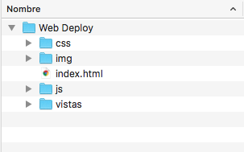

Al iniciar un proyecto web debemos de tener en cuenta como se va realizar la estructura de carpetas, ya que de esa manera todos nuestros archivos determinaran el orden y la jerarquía del mismo.

En este caso vamos a trabajar en un proyecto simple de desarrollo web utilizando HTML, CSS, Y Javascript.
<!--more-->

La manera de tener ordenados nuestros archivos, es disponer de las carpetas adecuadas iniciando con el nombre y las subcarpetas que contendrán dicho proyecto.

Iniciemos: Supongamos que vamos a realizar un sitio web para darnos a conocer por internet. El cual lo vamos a desarrollar con lo básico (HTML, CSS Y Js).

* Primeramente creamos una carpeta que contendrá todos los recursos necesarios. Ej: _Web Deploy_
* Dentro de esa carpeta vamos a crear otras carpetas como son:
    * **img**: Donde incluiremos nuestros archivos de imagenes.
    * **css**: Donde incluiremos los archivos con extensión css (estilos del sitio).
    * **js**: En esta carpeta vamos a incluir los archivos js (interactividad de nuestro sitio web).
    * **vistas**: En el caso de que realicemos páginas secundarias es importante tener los archivos html en dicha carpeta.     
* Y no olvidar el archivo que necesitamos para nuestro sitio web _index.html_ el cual contiene el contenido del sitio.

Básicamente con esa estructura tenemos listo nuestra carpeta e iniciar a trabajar en el desarrollo.

